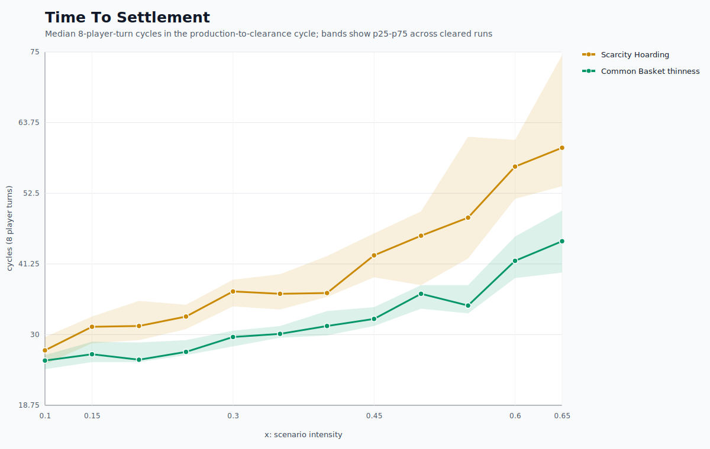

# Recipes: A Small Economy You Can Play

Recipes is a multiplayer cooking and trading game about getting the right ingredients to the right cooks, then clearing the promises created along the way. It looks like a social table game: eight cooks sit around a shared Common Basket, each cook brings one ingredient, and everyone is trying to complete recipes. Under the surface, it is also a compact economic system with production, exchange, credit, settlement, and consumption.

The game begins with symmetric endowments. Every cook owns one ingredient and starts with eight promise cards for that ingredient. Two cards from each cook begin in the Common Basket, leaving six in the owner's hand. A promise card is a reusable claim on a finite real ingredient stock. To cook, players need to collect the cards that match their recipes, redeem those cards into ingredients, and prepare finished dishes.

That creates the first economic problem: each player has supply, but demand is distributed across the whole table. A cook's own ingredient appears in their recipes, but it is never enough by itself. Progress depends on circulation.

## The Common Basket

The Common Basket is the public clearing pool. A cook can give one card to the basket and take one visible card back. This reduces search costs because players do not always need to find a perfect direct counterparty. If the basket is liquid, players can solve many recipe problems through public swaps.

Direct offers still matter. When the basket does not contain the needed card, a player can make a structured offer to another player. There is no free chat in the MVP, so bargaining is constrained to visible public summaries and legal offer terms. That keeps the game focused on asset movement rather than negotiation text.

Together, basket swaps and direct offers create two trade channels:

- the Common Basket, which is public, fast, and broad;
- direct exchange, which is targeted, slower, and useful for specific shortages.

## Production Is Not The End

Recipes is not complete when the last dish is produced. After every cook reaches the dish goal, the table must settle. Settlement means every outstanding promise card has to return to the correct accounting condition:

- each cook has exactly two own cards in the Common Basket;
- each cook has exactly six own cards in hand;
- no cook holds another cook's promise cards;
- no cook's cards remain in another player's hand;
- no food parts remain in the platter.

Only after this clearance condition is reached can eating begin. This is why the analysis uses the term **production-to-clearance cycle**. The important metric is not simply "time to make all dishes." It is the time from the start until all products are produced and all obligations are cleared back to the starting settlement condition.

For the presentation chart, this is shown as **Time To Settlement**, measured in cycles. One cycle is eight player turns: a full round around the table.

## What The Monte Carlo Tested

The economic-time analysis uses a headless simulator that runs the authoritative TypeScript game rules. It keeps the raw Monte Carlo data intact, then renders a filtered presentation view focused on the two strongest frictions:

- **Scarcity Hoarding:** players withhold scarce own vouchers when another player requests them, when a basket copy is low-count, or when settlement would move a scarce promise card back toward clearance.
- **Common Basket thinness:** players skip otherwise useful Common Basket swaps during production or settlement, pushing the table toward slower direct coordination.

Both frictions affect production and settlement. That matters because a game can appear healthy while dishes are being made, then slow down sharply when the table has to unwind its obligations.

The chart shows that increasing either friction increases time to settlement. Scarcity Hoarding is especially damaging because it attacks bottleneck assets. Common Basket thinness is also costly because it weakens the shared clearing mechanism that normally keeps assets moving.

## Why Scarcity Hoarding Hurts

Scarcity Hoarding is not just ordinary holding. It targets cards that are locally scarce or needed for clearance. A single withheld card can block a recipe, keep another cook from finishing a dish, or prevent settlement from restoring the table to its final accounting condition.

This is a familiar economic pattern: when a scarce input is withheld, the delay is not proportional only to the missing item. The blocked input can stall downstream production, create extra search, force less efficient trades, and leave more obligations unresolved.

In Recipes, scarcity becomes visible as longer cycles to settlement. The table is not short of all ingredients. It is short of the right promise card in the right place at the right time.

## Why Basket Thinness Hurts

Common Basket thinness weakens the public market. When players skip useful basket swaps, assets still exist, but the low-friction path for moving them is underused. The table falls back on direct offers and turn-by-turn coordination.

This raises the cost of matching. Instead of one public swap solving a local need, the table may require several passes, offers, refusals, or settlement swaps. Basket thinness therefore increases both production time and settlement time.

The design question is not whether direct trade should disappear. Direct trade is important for specific shortages. The question is whether the public pool is active enough to prevent the whole economy from becoming bilateral and slow.

## Discussion Topics

**1. Is the Common Basket doing enough clearing work?**

If the basket is too thin, players may understand what they need but still struggle to move assets efficiently. Useful discussion: should the UI make high-value basket swaps more visible, or should bots use the basket more aggressively?

**2. How should the game communicate scarcity?**

Scarcity in Recipes is often positional, not absolute. A card may exist, but be held by the wrong player, locked in an offer, or withheld by its owner. Useful discussion: should players see stronger signals about scarce ingredients, blocked recipes, or settlement bottlenecks?

**3. When does strategic holding become unfun hoarding?**

Some holding is legitimate. Players should protect cards they need for their own recipes. But withholding surplus or low-stock cards can slow the whole table. Useful discussion: should the game rely on incentives, clearer information, bot behavior, or rule changes to discourage harmful holding?

**4. Is settlement satisfying as a game phase?**

Settlement is the economic payoff of the promise-card system. It makes the game more than a race to produce dishes. But it must feel legible and purposeful. Useful discussion: should settlement actions have clearer guidance, stronger automation for bots, or more visible account status?

**5. What should "winning" mean in a closed economy?**

Recipes can track dishes produced, food eaten, settlement speed, trade balance, and consumption distribution. Useful discussion: should the game emphasize the first player to finish, collective clearance, equal consumption, efficient trade, or some mix of these?

**6. How much friction makes the game interesting?**

Zero friction would make Recipes mechanical. Too much friction turns the economy into a traffic jam. Useful discussion: what level of scarcity, basket depth, and direct exchange produces good table conversation without creating dead turns?

## Why This Matters

Recipes is a game about cooking, but its core loop is economic. Players create obligations by moving promise cards, transform claims into products by redeeming them, and finish by clearing the obligations that production created. The result is a playable model of a small production economy.

That makes the game useful for design discussion beyond "is it fun?" It invites questions about liquidity, settlement, hoarding, public pools, bilateral exchange, bottlenecks, and the difference between making goods and clearing the obligations created while making them.

The current analysis points to a clear design priority: keep scarce assets and the Common Basket legible. If players can see where the bottlenecks are and if the public pool remains active, the production-to-clearance cycle should feel like a cooperative economy rather than a stalled accounting exercise.
